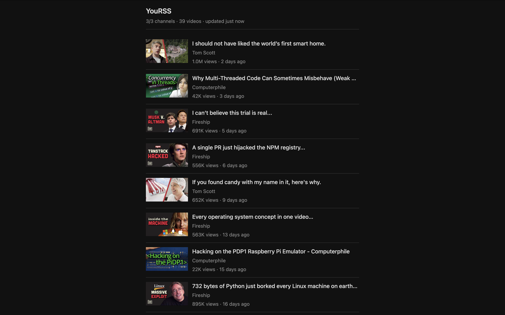

# YouRSS

A minimal, no frills RSS feed reader for YouTube.



The header shows fetch health (`3/3 channels · 39 videos · updated 2 minutes ago`) and keeps cached results when a channel fails to refresh.

## Configuration

Create a `config.yaml` in the working directory:

```yaml
channels:
  Computerphile: "UC9-y-6csu5WGm29I7JiwpnA"
  Fireship: "UCsBjURrPoezykLs9EqgamOA"
  TomScott: "UCBa659QWEk1AI4Tg--mrJ2A"
```

The key is a label for your own reference (used in logs and error messages). The value is the YouTube channel ID from the channel URL.

## Run locally

Requires Go 1.23+.

```bash
go run main.go
```

Or:

```bash
make
```

Open http://localhost:8080. Feeds refresh every 5 minutes.

## Docker

Prebuilt image from GitHub Container Registry:

```bash
docker run -d -p 8080:8080 -v /path/to/config.yaml:/config.yaml ghcr.io/vojkovic/yourss
```

Build and run locally:

```bash
make docker
```

### Docker Compose

```yaml
services:
  yourss:
    image: ghcr.io/vojkovic/yourss
    restart: always
    ports:
      - "8080:8080"
    volumes:
      - /path/to/config.yaml:/config.yaml
```

```bash
docker compose up -d
```
